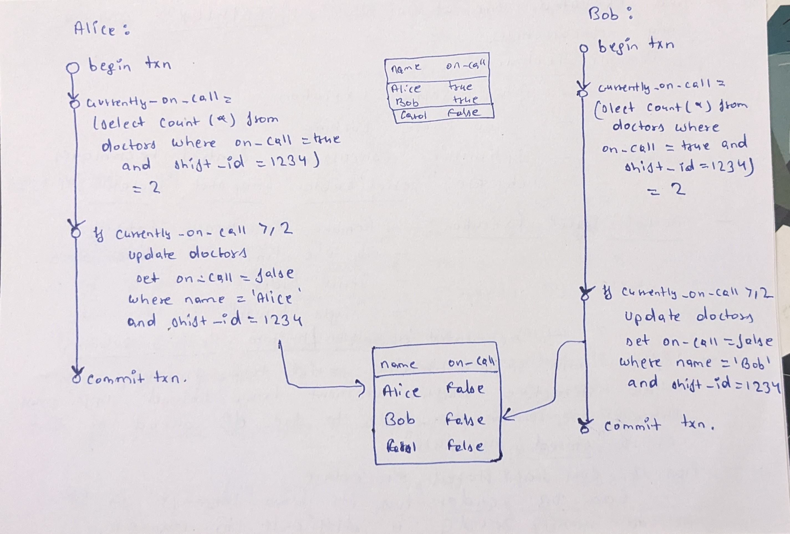

Isolation Levels
G0: Write Cycles (dirty writes)
G1a: Aborted Reads (dirty reads, cascaded aborts)
Remember:-  A transaction can typically see its own changes before it commits. In most relational database systems, the changes made within a transaction are immediately visible to that transaction itself, even before the transaction is committed.
- By default transaction set is repeatable read in this mysql.
- Insert that we are performing in main block are also in repeatable read isolation level. So we need to commit those inserts before being visible to other transactions (read committed). But read uncommitted transaction can see uncommitted changes.

- The release of locks in a transaction depends on whether the transaction completes (either by committing or rolling back) and the isolation level being used.
    - Read Committed and Repeatable Read:- Locks acquired by a transaction are typically released when the query completes, not necessarily when the transaction is committed. This means that once a query within the transaction is finished, the locks held by that query are released, potentially allowing other queries or transactions to access the locked data. ( Alternate print statements in read_committed.py )
    - Serializable: In the "Serializable" isolation level, locks are often held until the transaction is committed. This provides the highest level of isolation and ensures that the locked data remains consistent throughout the entire transaction.

- Read Uncommitted
    - A transaction can see changes to data made by other transactions that are not committed yet.
    - With this isolation level, there is always chance of getting a “Dirty-Read”.
    - MySQL "read uncommitted" prevents Write Cycles (G0) by locking updated rows.
    - MySQL "read uncommitted" does not prevent Aborted Reads (G1a):
    - There might be some race conditions on row which is updated by both the transactions.
        - It depends upon who acquires lock first while updating.
        - Sometime (sometime not) we see newly inserted (thread 2) row with id 3 in thread 1 because in read uncommitted we can see uncommitted changes in another transaction.
    - In the example shown, both T1, T2 tries to update row with id = 1, which might cause issues since updating same row acquires locks.
        - Then it might depend on several factors in another transaction (T2) who is updating same row like ...
            - If that lock is still held by transaction (T1), then T2 won't be able to make the changes.
            - Or when T2 tried to acquire lock, was the lock released by T1, if released T2 can safely update the row.
            - In some cases lock is released by transaction after certain timeout.
    - This is the reason in the main thread we are seeing id 1 with value either 11 or 12.
    - But there is consistency in id 2 value as this is updated by T1 only.
    -  In this isolation level, you can read uncommitted changes made by other transactions, including rows that are locked by other transactions. This can lead to dirty reads, where you see data that might not end up being committed.

- Read Committed
    - When reading from db, you will only see data that has been committed. ( No dirty reads )
    - When writing to the db, you will only overwrite data that has been committed. ( No dirty writes )
    - This level allows transactions to see only committed changes made by other transactions.
    - When we see row id 3 in T1, it means that T2 has already been committed. To make sure this is happening, we can add a rollback in T2 and check if that still happening.
        - When we rollback in T2, no changes are reflected in T1 and main thread.
    - In this isolation level, you can only read committed changes made by other transactions. If a row is locked by another transaction, attempting to select that row will either block until the lock is released or return after a timeout, depending on the database system's configuration.

- Snapshot Isolation
    - The idea is each transaction reads from a consistent snapshot of the database i.e transaction sees all the data that was committed in the db at the start of transaction.
    - Even if data is subsequently changed by another transaction, each transaction sees only the old data from that particular point in time.
    - Boon for backups and analytics.
    - Key :- Readers never block writers and writers never block readers.
    - The db must potentially keep several different committed version of an object, because various in progress transactions may need to see the state of db at different points in time.
    - Uses MVCC (multi version concurrency control)
    - Snapshot is like a screenshot of committed data in the db.
    - Read committed uses a separate snapshot for each query ( in a transaction ), while snapshot isolation uses the same snapshot for an entire transaction.
    - Transaction Ids are used to tag data written by transaction.
        - When a transaction reads from database, txn Ids are used to decide which objects it can see and which are visible.
    - An update is converted into delete and create.
    - An object is visible if both the conditions are true:-
        - At the time when reader's transaction started, tha transaction that created the object had already committed..
        - The object is not marked for deletion or if it is, that transaction that requested the deletion had not yet committed at the time when the reader's transaction started.
    - Another way to put visibility of an object:
        - When transactions start, they are given an ever increasing txn id.
        - Let's say a txn start reading objects from db, there will be three cases:-
            - All txn that are in progress at that point in time ( not committed yet ), even though they are eventually committed will be ignored.
            - All txn that are aborted later, will be ignored.
            - All txn with id greater than the current txn will be ignored.
            - Rest all other objects will be visible to current txn.
    - New version is created everytime a value is changed rather than updating value inplace.
    - But mysql does not provide native support for snapshot isolation. ( https://stackoverflow.com/questions/9880555/how-to-set-innodb-in-mysql-to-the-snapshot-isolation-level )

- Repeatable Read
    - It Ensures that once a transaction reads a row of data, that data will remain unchanged for the duration of the transaction. This is achieved by placing shared locks on the rows being read.
    - These locks prevent other transactions from modifying the locked rows until the reading transaction completes.
    - When one transaction holds a lock on a row, another transaction attempting to access the same locked row might be blocked until the lock is released.
    - Here's what typically happens in "Repeatable Read" isolation:
        - Lock Acquisition:- When Transaction A reads a row in the "Repeatable Read" isolation level, it acquires a shared lock on that row. This lock prevents other transactions from acquiring an exclusive (write) lock on the same row, ensuring that the data isn't modified while Transaction A is using it.
        - Blocked Transaction:- If Transaction B attempts to read the same row that Transaction A has locked, Transaction B will be blocked until the lock held by Transaction A is released. This ensures that Transaction B sees a consistent view of the data and doesn't read data that might change before it is committed.
        - Lock Release:- Once Transaction A releases the shared lock (typically by committing or rolling back the transaction), Transaction B is unblocked and can proceed to access the row.
    - If you're experiencing situations where Transaction B is blocked and not returning any data, it's likely because the row it's trying to access is currently locked by Transaction.
    - Once Transaction A releases the lock, Transaction B should be able to access the row and retrieve the data.
    - Here's how it typically works:-
        - Write Visibility: When a transaction in the "Repeatable Read" isolation level performs updates, inserts, or deletes, those changes are made within the context of the transaction itself. Other transactions running concurrently will not see these changes until the modifying transaction is committed.
        - Reads Within the Same Transaction: If the modifying transaction performs a read after making changes, it will see the updated data as part of its consistent view. This is because the transaction itself maintains a consistent snapshot of the data it has seen, and its own changes are included in that snapshot.
        - Visibility to Other Transactions: Other transactions running concurrently in "Repeatable Read" isolation level will not see the changes made by the modifying transaction until it is committed. They will continue to see the data as it existed at the start of their own transactions.

- Lost Updates
    - When two concurrent transactions increment the same value.
    - The lost update problem occur if an application reads some value from the db, modifies it and writes back the modified value. ( Read-modify-write cycle )
    - If two transactions do this concurrently, one of the modifications can be lost, because the second write does not include the first modification.
    - Solutions:-
        - Atomic Write Operations:
            - Many db provide atomic update ops, which remove the need to implement read-modify-write cycle in application code.
                - Update counters set value = value + 1 where key = 'foo';
            - Atomic ops are usually implemented by taking an **exclusive** lock on the object when it is read so that no other transaction can read it until the update has been applied.
            - This technique is known as cursor ability.
        - Explicit Locking
            - If db's built in atomic ops do not provide necessary functionality then application have to explicitly lock objects that are going to be updated.
                - BEGIN TRANSACTION;
                - SELECT * from table_name where key="foo" FOR UPDATE;
                - COMMIT;
            - The FOR UPDATE clause indicates that db should take a lock on all rows returned by this query.
        - Compare and set
            - The purpose of this ops is to avoid lost updates by allowing an update to happen only if the value has not changed since you last read it.
                - UPDATE wiki_pages SET content = 'new content' WHERE id = 1234 and content = 'old content';
            - If db allows WHERE clause to read from an old snapshot, this statement may not prevent lost updates, because condition may be true even though another concurrent write is occuring.

- Write Skew and phantoms
    - Let's take an example of write skew.
    - Writing an example for doctors to manage their on-call shifts at a hospital.
    - Important to have atleast one doctor on call at any time.
    - Doctors can themselves be sick and apply for leave, but one doctor must be on call.
    - 
    - The example in above image is neither a dirty write nor a lost update, because two transactions are updating two different objects. ( Race condition )
    - Write skew is a generalization of lost update problem.
    - Either use a serializable isolation level or the second best option is to explicit lock the rows.
        - BEGIN TRANSACTION;
            - SELECT * FROM doctors where on_call = true and shift_id = 1234 for update;
            - Update doctors set on_call = false where name = 'Alice' and shift_id = 1234;
        - COMMIT;
    - In cases where select query returns nothing, SELECT FOR UPDATE can't attach locks to anything.
        - This effect, where a write in one transaction changes the results of a search query in another transaction, is called a phantom.
        - If the problem of phantoms is that there is no object to which we can attach the locks, perhaps we can artificially introduce a lock object into the db. ( Materializing Conflicts )

- Serializable Isolation
    - Strongest Isolation Level
    - It guarantees that even though txns may execute in parallel, the end result is the same as if they had executed one at a time, serially without any concurrency.
    - Avoid the coordination overhead of locking.
    - Systems with single threaded serial trnsaction processing don;t allow interactive multi-statement transactions. Instead, application must submit the entire transaction code to the db ahead of time, as a stored procedure. Provided that data required by txn is in memory, stored procedure can execute very fast, without waiting for any network IO or disk IO.
    - When we run serializable.py file, we will notice that thread1 not able to insert (gives timeout) as thread2 starts first and run upto completion but do not commit, which blocks thread1 to proceed and hence we get lock timeout error.
    - There might occur deadlock as well, if you see the code carefully, both threads reading same object and trying to update the same object by taking lock.
    - Read Locks: In "Serializable" isolation, when a transaction reads a row of data, it typically acquires a read lock on that row. This read lock prevents other transactions from acquiring exclusive (write) locks on the same row, effectively blocking any modifications to the data.
    - Write Locks: When a transaction modifies a row (e.g., with an INSERT, UPDATE, or DELETE), it acquires an **exclusive** lock on that row. **This exclusive lock prevents other transactions from reading or modifying the locked row until the modifying transaction is completed**.

NOTE:-
    - **Shared Locks**: When a transaction acquires a shared lock on an object, it is essentially declaring its intention to read the object. Multiple transactions can simultaneously acquire shared locks on the same object.
    - **Exclusive Locks**: Exclusive locks (also known as write locks) are not compatible with shared locks. If one transaction holds an exclusive lock on an object, no other transaction can acquire an exclusive or shared lock on the same object until the exclusive lock is released.
